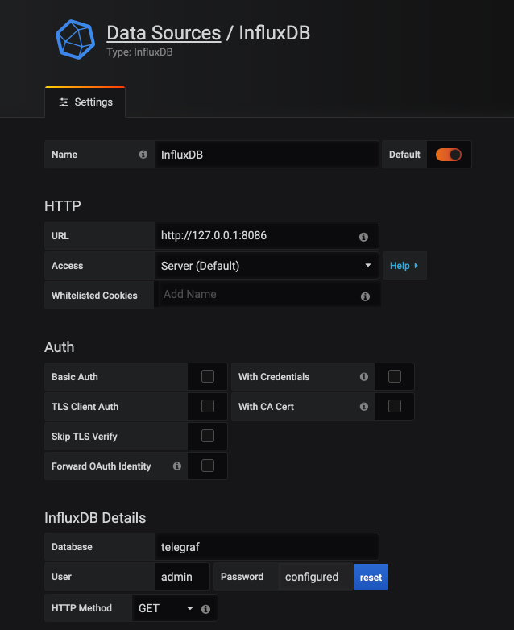
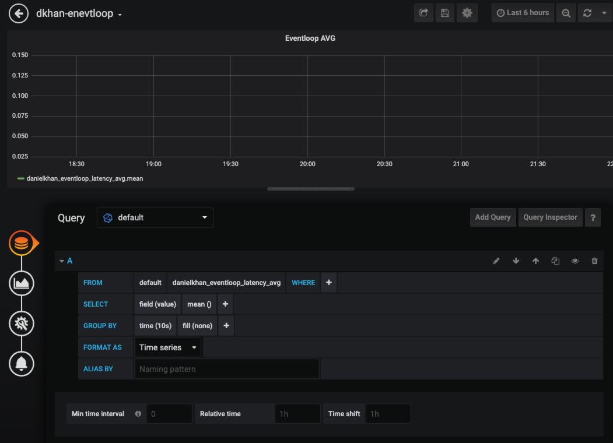

# Installing the services

`git clone ...`

Create 4 terminal windows.
Change in each directory and run `npm install` followed by `npm start`.

Copy `.env-sample` to `.env`.

Change MY_HANDLE.
Set DB Password.

Run all services

# Collecting metrics

# Install metrics tooling

## Telegraf and InfluxDB
wget -qO- https://repos.influxdata.com/influxdb.key | sudo apt-key add -
source /etc/lsb-release
echo "deb https://repos.influxdata.com/${DISTRIB_ID,,} ${DISTRIB_CODENAME} stable" | sudo tee /etc/apt/sources.list.d/influxdb.list

## InfluxDB

sudo apt-get update && sudo apt-get install influxdb
sudo systemctl unmask influxdb.service
service influxdb start

## Telegraf

sudo apt-get update && sudo apt-get install telegraf
service telegraf start

/etc/telegraf/telegraf.conf
Uncomment statsd
Restart telegraf


## Grafana
sudo apt install -y software-properties-common
sudo add-apt-repository "deb https://packages.grafana.com/oss/deb stable main"
sudo wget -q -O - https://packages.grafana.com/gpg.key | apt-key add -
sudo apt update
sudo apt install -y grafana

service grafana-server start
http://tracing.khan.io:3000
Configure datasource influxdb



## Sending metrics from Node.js
`npm install -S appmetrics-statsd`

In app.js:

```js


// express-frontend
const statsdpfx = `${process.env.MY_HANDLE}_express-frontend_`;
const statsd = require('appmetrics-statsd').StatsD(
  { host: process.env.COLLECTOR, prefix: statsdpfx}
);

// service-gateway
const expressStatsd = require('express-statsd');
const statsdpfx = `${process.env.MY_HANDLE}_express-frontend_`;
const statsd = require('appmetrics-statsd').StatsD(
  { host: process.env.COLLECTOR, prefix: statsdpfx }
);

// service-green
const expressStatsd = require('express-statsd');
const statsdpfx = `${process.env.MY_HANDLE}_service-green_`;
const statsd = require('appmetrics-statsd').StatsD(
  { host: process.env.COLLECTOR, prefix: statsdpfx }
);

// service-blue
const expressStatsd = require('express-statsd');
const statsdpfx = `${process.env.MY_HANDLE}_service-blue_`;
const statsd = require('appmetrics-statsd').StatsD(
  { host: process.env.COLLECTOR, prefix: statsdpfx }
);

```

Metrics descriptions https://github.com/RuntimeTools/appmetrics-statsd.

Hit `http://localhost:8080` a few times.


## Create a dashboard



## Define Alerts


## Create a Dashboard for memory_process_virtual
* Fix metric

## Create a dashboard that shows error 500
Add a dashboard that shows error 500 and 200.


Add a middleware for express metrics:

```js
app.use((req, res, next) => {
  var startTime = new Date().getTime();

  // Function called on response finish that sends stats to statsd
  function sendStats() {
    var key = 'http-express-';

    // Status Code
    var statusCode = res.statusCode || 'unknown_status';
    statsd.increment(key + 'status_code.' + statusCode);

    // Response Time
    var duration = new Date().getTime() - startTime;
    statsd.timing(key + 'response_time', duration);

    cleanup();
  }

  // Function to clean up the listeners we've added
  function cleanup() {
    res.removeListener('finish', sendStats);
    res.removeListener('error', cleanup);
    res.removeListener('close', cleanup);
  }

  // Add response listeners
  res.once('finish', sendStats);
  res.once('error', cleanup);
  res.once('close', cleanup);

  if (next) {
    next();
  }
})
```

Hit `http://localhost:8080` a few times.


# Install Jaeger Tracing

```bash
$ docker run -d --name jaeger \
  -e COLLECTOR_ZIPKIN_HTTP_PORT=9411 \
  -p 5775:5775/udp \
  -p 6831:6831/udp \
  -p 6832:6832/udp \
  -p 5778:5778 \
  -p 16686:16686 \
  -p 14268:14268 \
  -p 9411:9411 \
  jaegertracing/all-in-one:1.13
```

Frontend `http://tracing.khan.io:16686`.


